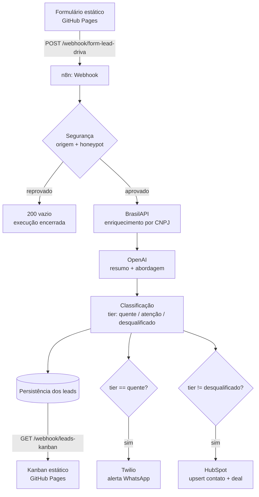

# Lead Qualify — Driva

Protótipo funcional de captura, enriquecimento e qualificação automática de
leads B2B, inspirado nos 4 pilares da plataforma da [Driva](https://driva.io):
inteligência de mercado, geração de leads, engajamento e IA.

**Formulário:** https://kristhianno.github.io/lead_qualify
**Kanban de leads:** https://kristhianno.github.io/lead_qualify/kanban.html

## O que o projeto faz

1. **Captura** — formulário público (`index.html`) com validação client-side
   completa: nome, e-mail, CNPJ (inclusive o novo formato alfanumérico da
   Receita Federal, com dígito verificador calculado), WhatsApp e ticket médio
   mensal. Protegido contra bots com honeypot.
2. **Enriquecimento** — o webhook do n8n consulta a BrasilAPI a partir do
   CNPJ para trazer razão social, CNAE e situação cadastral.
3. **Qualificação com IA** — um modelo de linguagem (OpenAI) gera um resumo da
   empresa e uma sugestão de abordagem comercial por lead.
4. **Classificação** — os leads são segmentados automaticamente em `quente`,
   `atenção` e `desqualificado`.
5. **Ação** — leads quentes disparam um alerta de WhatsApp em tempo real para
   o time comercial; todos os leads qualificados são sincronizados com o
   HubSpot.
6. **Visualização** — o Kanban (`kanban.html`) mostra os leads por coluna,
   com os dados enriquecidos e a sugestão da IA.

## Arquitetura

## Stack

| Camada | Tecnologia |
|---|---|
| Front-end | HTML/CSS/JS estático, hospedado no GitHub Pages |
| Automação/orquestração | [n8n](https://n8n.io) (self-hosted, Easypanel) |
| Enriquecimento de dados | [BrasilAPI](https://brasilapi.com.br) |
| Qualificação | OpenAI (`gpt-4o-mini`) |
| Alertas | Twilio (WhatsApp) |
| CRM | HubSpot |

O passo a passo detalhado de cada nó do workflow n8n está em
[`docs/n8n-workflows.md`](docs/n8n-workflows.md).

## Por que este projeto

Construído como estudo de caso prático para a vaga de **Analista de
Automações** na Driva — usando deliberadamente a mesma stack que a empresa
já integra nativamente (n8n, HubSpot), para demonstrar não só a automação em
si, mas a preocupação com custo (segurança do webhook antes de acionar APIs
pagas), tempo de resposta comercial (alerta em tempo real) e uso de IA para
qualificação, não só para geração de texto.
