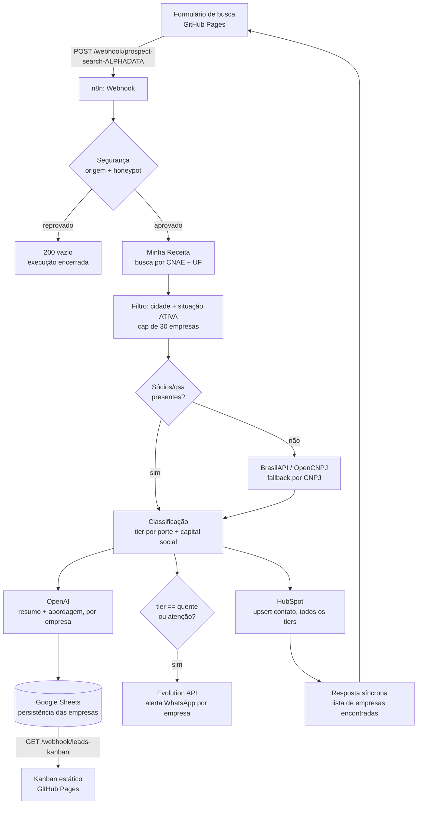

# Lead Qualify — Driva

Protótipo funcional de prospecção, enriquecimento e qualificação automática
de leads B2B, inspirado nos 4 pilares da plataforma da
[Driva](https://driva.io): inteligência de mercado, geração de leads,
engajamento e IA.

**Formulário:** https://kristhianno.github.io/lead_qualify
**Kanban de leads:** https://kristhianno.github.io/lead_qualify/kanban.html

## O que o projeto faz

1. **Busca** — formulário público (`index.html`) onde o usuário informa
   segmento, estado e cidade. Protegido contra bots com honeypot.
2. **Prospecção e enriquecimento** — o webhook do n8n consulta a
   [Minha Receita](https://minhareceita.org) (API pública, gratuita e
   open-source sobre os dados abertos da Receita Federal) por CNAE + UF,
   filtra os resultados por cidade e situação cadastral `ATIVA`, e traz
   razão social, CNAE, porte, capital social, e-mail, telefone e sócios de
   cada empresa. BrasilAPI/OpenCNPJ entram como fallback quando um registro
   vem sem sócios (`qsa`) na busca inicial.
3. **Qualificação com IA** — um modelo de linguagem (OpenAI) gera um resumo da
   empresa e uma sugestão de abordagem comercial por empresa encontrada.
4. **Classificação** — cada empresa é segmentada automaticamente em `quente`,
   `atenção` e `desqualificado` a partir do porte e do capital social.
5. **Ação** — empresas `quente` e `atenção` disparam um alerta de WhatsApp em
   tempo real para o time comercial via Evolution API; todas as empresas
   encontradas são sincronizadas com o HubSpot.
6. **Visualização** — os resultados aparecem na própria tela de busca e no
   Kanban (`kanban.html`), com os dados enriquecidos e a sugestão da IA.

## Arquitetura

```mermaid
flowchart TD
    A[Formulário de busca<br/>GitHub Pages] -->|POST /webhook/prospect-search-ALPHADATA| B[n8n: Webhook]
    B --> C{Segurança<br/>origem + honeypot}
    C -->|reprovado| X[200 vazio<br/>execução encerrada]
    C -->|aprovado| D[Minha Receita<br/>busca por CNAE + UF]
    D --> D2[Filtro: cidade + situação ATIVA<br/>cap de 30 empresas]
    D2 --> D3{Sócios/qsa<br/>presentes?}
    D3 -->|não| D4[BrasilAPI / OpenCNPJ<br/>fallback por CNPJ]
    D3 -->|sim| F
    D4 --> F[Classificação<br/>tier por porte + capital social]
    F --> E[OpenAI<br/>resumo + abordagem, por empresa]
    E --> G[(Google Sheets<br/>persistência das empresas)]
    F --> H{tier == quente<br/>ou atenção?}
    H -->|sim| I[Evolution API<br/>alerta WhatsApp por empresa]
    F --> K[HubSpot<br/>upsert contato, todos os tiers]
    K --> R[Resposta síncrona<br/>lista de empresas encontradas]
    R --> A
    G -->|GET /webhook/leads-kanban| L[Kanban estático<br/>GitHub Pages]
```

## Stack

| Camada | Tecnologia |
|---|---|
| Front-end | HTML/CSS/JS estático, hospedado no GitHub Pages |
| Automação/orquestração | [n8n](https://n8n.io) (self-hosted, Easypanel) |
| Busca/prospecção | [Minha Receita](https://minhareceita.org) (gratuita, open-source, dados abertos da Receita Federal) |
| Enriquecimento de fallback | [BrasilAPI](https://brasilapi.com.br) (fallback OpenCNPJ) |
| Persistência | Google Sheets |
| Qualificação | OpenAI (`gpt-4o-mini`) |
| Alertas | Evolution API (WhatsApp) |
| CRM | HubSpot |

O passo a passo detalhado de cada nó do workflow n8n está em
[`docs/n8n-workflows.md`](docs/n8n-workflows.md).

## Por que este projeto

Construído como estudo de caso prático para a vaga de **Analista de
Automações** na Driva — usando deliberadamente a mesma stack que a empresa
já integra nativamente (n8n, HubSpot), para demonstrar não só a automação em
si, mas a preocupação com custo (segurança do webhook antes de acionar APIs
pagas), tempo de resposta comercial (alerta em tempo real) e uso de IA para
qualificação, não só para geração de texto.
